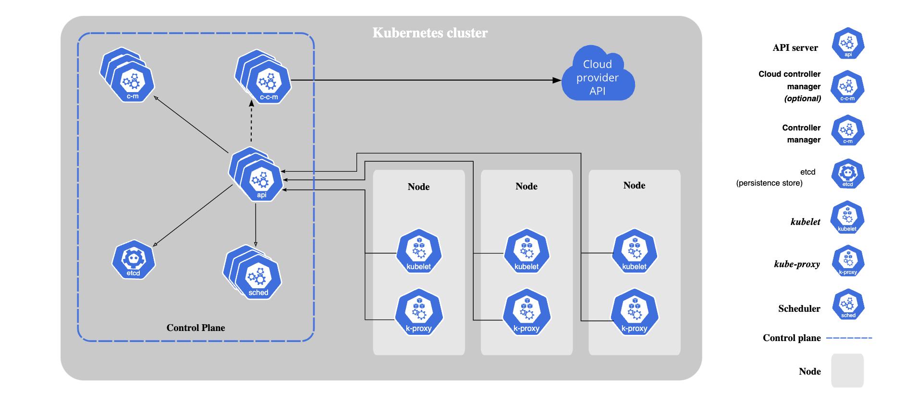

## Kubernetes
Kubernetes is an open-source container orchestration platform that helps manage and automate the deployment, scaling, and management of containerized applications. It provides a framework for running and coordinating containers across a cluster of machines.

Here are the key components of Kubernetes architecture:

### Master Node:
 The master node is the control plane of the Kubernetes cluster. It manages and coordinates the overall cluster operations. It consists of several components:

1. API Server: The API server is the central management point for the cluster. It exposes the Kubernetes API, which allows users and other components to interact with the cluster.
   
2. Scheduler: The scheduler assigns containers to nodes based on resource requirements, availability, and other constraints.
   
3. Controller Manager: The controller manager ensures that the desired state of the cluster matches the actual state. It manages various controllers responsible for tasks like scaling, replication, and self-healing.
   
4. etcd: etcd is a distributed key-value store that stores the cluster's configuration data and provides high availability and consistency.
   
### Worker Nodes: 
Worker nodes are the machines where containers are deployed and run. They form the compute resources of the cluster. Each worker node runs the following components:

1. Kubelet: The kubelet is an agent that runs on each worker node and communicates with the master node. It manages the containers on the node, ensuring they are running and healthy.
   
2. Container Runtime: The container runtime, such as Docker, is responsible for pulling container images and running them as containers on the node.
   
3. Kube-proxy: Kube-proxy is responsible for network proxying and load balancing across services in the cluster.